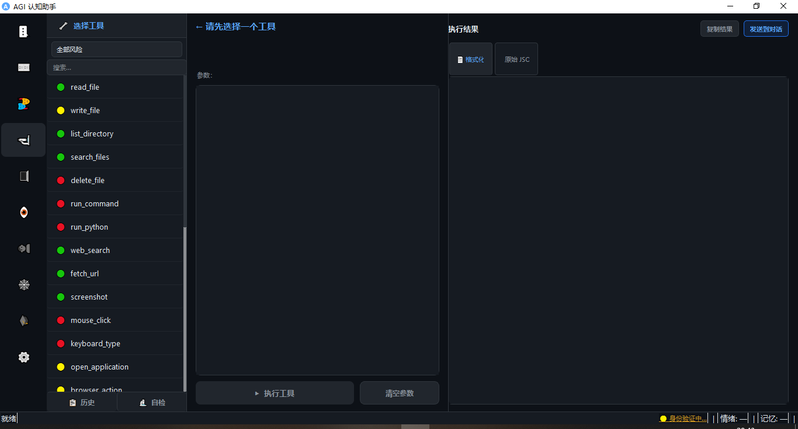
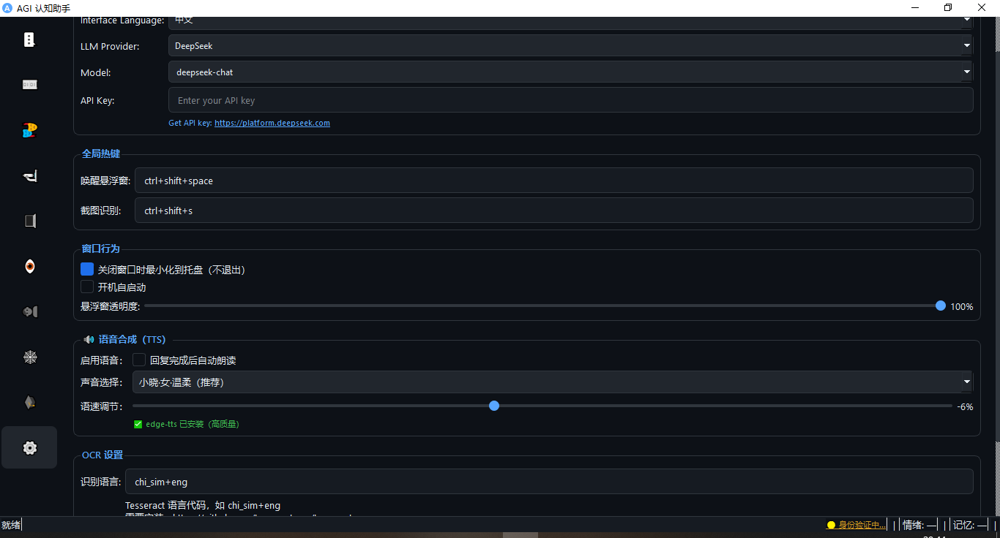

# AGI 认知助手

<p align="center">
  <b>模拟人类认知架构的桌面 AI 助手</b><br>
  分层记忆 · 情感加权 · 关联检索 · 人格成长
</p>

<p align="center">
  
  
  
  
</p>

<p align="center">
  <a href="README.md">English</a> | 简体中文
</p>

---

## 功能特性

- **A/B 双层架构** — A 层（意识层）拥有人格、情感、判断力；B 层（执行层）调用 LLM + 工具
- **分层记忆系统** — SQLite + 向量检索，三级存储（大纲/细纲/片段）+ 关联网络 + 两阶段检索
- **用户画像** — 逐步积累性格特征，检测异常行为，身份验证
- **27 个内置工具** — 文件操作、系统控制、网页搜索、浏览器自动化、OCR、编程智能体、Office 文件、股票、新闻
- **成长引擎** — 人格漂移 + 主动学习 + 体验认知（去重合并 + 活跃度衰减）— AGI 在对话中不断进化
- **手机端 Web 客户端** — 内置 Web 服务（FastAPI），手机浏览器直接聊天，与桌面端共享同一个 Agent 实例和记忆
- **主动对话** — AGI 自主发起话题，用户回复后完整记忆链存储（系统→用户→AI 三方合一）
- **6 个 LLM 供应商** — DeepSeek / OpenAI / Groq / Claude / Gemini / Ollama（100% 本地）
- **多语言支持** — 中文 / English / 日本語 / 한국어 / Español / العربية
- **语音合成** — Microsoft Edge TTS，多种语音
- **人脸识别** — 多引擎（InsightFace / face_recognition / OpenCV），多用户身份
- **桌面集成** — 系统托盘、全局热键、悬浮窗、截图 OCR、开机自启

---

## 快速开始

### Windows（推荐）

1. **安装 Python 3.10+**：前往 https://www.python.org/downloads/
   - **必须勾选** `Add Python to PATH`
2. **双击 `install.bat`** — 安装所有依赖
3. **双击 `launch.bat`** — 启动应用

安装好 Python 后只需双击两次即可！

### Linux / macOS

```bash
# 1. 确保 Python 3.10+ 和 pip 已安装
# Ubuntu: sudo apt install python3 python3-pip
# macOS:   brew install python3

# 2. 安装依赖
chmod +x install.sh launch.sh
./install.sh

# 3. 启动
./launch.sh
```

---

## 截图预览

| 主对话 | 工具面板 | 设置 |
|:---------:|:----------:|:--------:|
|  |  |  |

---

## 项目结构

```
agi_app/
├── main.py                  # 入口（PyQt6 桌面应用）
├── server.py                # 手机端 Web 服务（FastAPI，共享 Agent 实例）
├── install.bat / install.sh # 一键安装脚本
├── launch.bat / launch.sh   # 启动脚本
├── build.py                 # PyInstaller 打包脚本
├── requirements.txt         # Python 依赖
│
├── engine/                  # AGI 核心引擎
│   ├── models.py            # 数据模型（人格/记忆/情感/模态）
│   ├── memory.py            # SQLite 向量记忆存储（CRUD + 衰减）
│   ├── memory_manager.py    # 分层检索（两阶段检索）
│   ├── association.py       # 记忆关联网络（有向加权图）
│   ├── agent.py             # A 层意识体（感知→记忆→推理→工具→生成）
│   ├── executor.py          # B 层工具执行循环（ReAct，最多 8 步）
│   ├── tools.py             # 27 个工具函数
│   ├── coder.py             # 自主编程智能体（写→运行→修复循环）
│   ├── office_tools.py      # Office 文件工具（docx/xlsx/pptx/pdf）
│   ├── user_profile.py      # 用户画像（特征积累 + 异常检测）
│   ├── learner.py           # 成长引擎（人格漂移 + 主动学习 + 认知去重/衰减）
│   ├── auth.py              # 多用户身份验证
│   ├── face_recognition_engine.py  # 人脸识别（三引擎懒加载）
│   ├── llm_client.py        # LLM 客户端（DeepSeek/OpenAI/Groq/Claude/Gemini/Ollama）
│   ├── tts_engine.py        # 语音合成（Edge TTS / pyttsx3）
│   └── i18n.py              # 国际化（6 种语言）
│
├── desktop/                 # 桌面系统层
│   ├── config.py            # 配置管理、路径、QSS 暗色主题
│   ├── system.py            # 系统托盘、全局热键、开机自启
│   └── screenshot.py        # 截图选择器 + OCR 后台线程
│
└── ui/                      # UI 层（PyQt6）
    ├── main_window.py       # 主窗口（7 个功能标签页）
    └── float_window.py      # 悬浮窗（置顶、可拖拽、动画、主动对话回复）
```

---

## 首次配置

启动后，进入 **设置** 标签页进行配置：

| 设置项 | 说明 |
|--------|------|
| **LLM 供应商** | DeepSeek / OpenAI / Groq / Claude / Gemini / Ollama |
| **API Key** | 前往对应供应商官网获取（Ollama 无需） |
| **快捷键** | 自定义唤醒和截图快捷键 |
| **语言** | 中文 / English / 日本語 / 한국어 / Español / العربية |

### 支持的 LLM 供应商

| 供应商 | API Key 获取地址 | 备注 |
|--------|-----------------|------|
| **DeepSeek** | https://platform.deepseek.com | 推荐，价格实惠 |
| **OpenAI** | https://platform.openai.com | GPT-4o-mini 等 |
| **Groq** | https://console.groq.com | 有免费额度，速度快 |
| **Claude** | https://console.anthropic.com | Anthropic |
| **Gemini** | https://aistudio.google.com | Google |
| **Ollama** | https://ollama.ai | 100% 本地，无需 Key |

> **工具调用**：DeepSeek / OpenAI / Groq / 通义千问 / 智谱 GLM / 豆包 / Kimi / 文心一言 / 讯飞星火使用原生 function calling。Claude / Gemini / Ollama 使用 ReAct 提示词解析（工具描述嵌入提示词，JSON 输出）。所有供应商均支持真实的工具执行。

---

## 架构概览

```
用户输入
    │
    ▼
① 感知（LLM）→ 情绪 / 任务类型 / 话题标签
    │
    ▼
② 两阶段记忆检索
   阶段 1：向量搜索大纲 + 关联涟漪扩散
   阶段 2：按大纲方向拉取细节
   + 用户画像（始终注入）
    │
    ▼
③ 推理（LLM）→ 决定工具使用、存储策略
    │
    ├── 需要工具 ──→ ④ B 层工具循环（ReAct，最多 8 步）
    │
    ▼
⑤ 生成回应（LLM）→ 人格驱动的输出
    │
    ▼
⑥ 存储 → 按重要性/情感分层记忆
    │
    ▼
⑦ 后台 → 用户画像 / 成长引擎 / 体验认知
```

---

## 工具列表（27 个）

| 分类 | 工具 |
|------|------|
| **文件系统** | `read_file` · `write_file` · `list_directory` · `search_files` · `delete_file` |
| **执行** | `run_command` · `run_python` |
| **网络** | `web_search`（DuckDuckGo + Bing）· `fetch_url` · `read_article`（newspaper3k） |
| **系统** | `screenshot` · `mouse_click` · `keyboard_type` · `open_application` · `get_system_info` · `read_clipboard` · `write_clipboard` |
| **浏览器** | `browser_action`（Playwright） |
| **Office** | `create_word` · `create_excel` · `create_pptx` · `create_pdf` · `read_office_file` |
| **金融** | `get_stock_info` · `search_stock` |
| **新闻** | `get_news` · `get_news_sources` |

所有高风险工具（`run_command`、`run_python`）执行前需要用户明确确认。

---

## 快捷键

| 快捷键 | 功能 |
|--------|------|
| `Ctrl+Shift+Space` | 显示/隐藏悬浮窗 |
| `Ctrl+Shift+S` | 选区截图 + OCR |

> 两个快捷键均可在设置中自定义。

---

## 可选增强功能

以下组件会在 `install.bat`/`install.sh` 中自动安装（如可能）：

```bash
# 语音合成（Microsoft Edge TTS，免费）
pip install edge-tts

# 手机端 Web 服务（手机浏览器聊天）
pip install fastapi uvicorn PyJWT

# Office 文件读写（Word/Excel/PPT/PDF）
pip install python-docx openpyxl python-pptx reportlab pdfplumber

# 语义向量（提升记忆检索质量，约 500MB）
pip install sentence-transformers

# 人脸识别（InsightFace 引擎，推荐）
pip install insightface onnxruntime opencv-python

# 浏览器自动化
pip install playwright && playwright install chromium

# 文章提取（智能新闻/文章解析器）
pip install newspaper3k

# 金融工具（股票信息与搜索）
pip install yfinance

# 新闻工具（需要 newsapi.org 的 API Key）
pip install newsapi-python
```

缺少可选依赖时会优雅降级 — 核心功能不受影响。

---

## 打包为独立可执行文件

```bash
pip install pyinstaller
python build.py windows   # → dist/AGI-Desktop.exe
python build.py linux     # → dist/AGI-Desktop
```

---

## 数据存储

所有数据存储在用户目录中 — 项目文件夹保持干净：

| 平台 | 数据目录 |
|------|---------|
| Windows | `%APPDATA%\AGI-Desktop\` |
| Linux/macOS | `~/.agi-desktop/` |

核心文件：
- `config.json` — 用户设置（API Key、快捷键等）
- `personality.json` — 人格配置
- `memory.db` — SQLite 数据库（记忆/关联/用户画像/人脸/成长）

---

## 常见问题

### "Python 未安装" 或 "'python' 不是内部或外部命令"

1. 前往 https://www.python.org/downloads/ 下载 Python
2. 安装时**勾选 "Add Python to PATH"**（关键！）
3. 重新打开命令提示符，再次运行 `install.bat`

### "No module named PyQt6"

重新运行 `install.bat`，或手动执行：`pip install -r requirements.txt`

### 控制台乱码

右键控制台标题栏 → 属性 → 字体 → 选择支持你所用语言的字体。

### 记忆检索质量不佳

安装语义向量：`pip install sentence-transformers`

### Ollama 工具调用不工作

Ollama 不原生支持 function calling。建议使用 DeepSeek API 以获得完整工具支持。

---

## 技术栈

- **UI**：PyQt6（暗色主题）
- **LLM**：DeepSeek / OpenAI / Groq / Claude / Gemini / Ollama
- **记忆**：SQLite + sentence-transformers（可选）
- **手机端**：FastAPI + Uvicorn + PyJWT
- **语音**：Edge TTS / pyttsx3
- **人脸**：InsightFace / face_recognition / OpenCV
- **Office**：python-docx / openpyxl / python-pptx / reportlab / pdfplumber
- **浏览器**：Playwright（可选）
- **金融**：yfinance
- **文章**：newspaper3k

---

## 许可证

[MIT](LICENSE)
